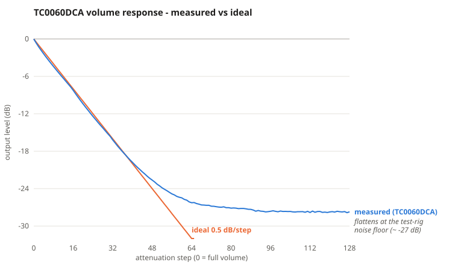
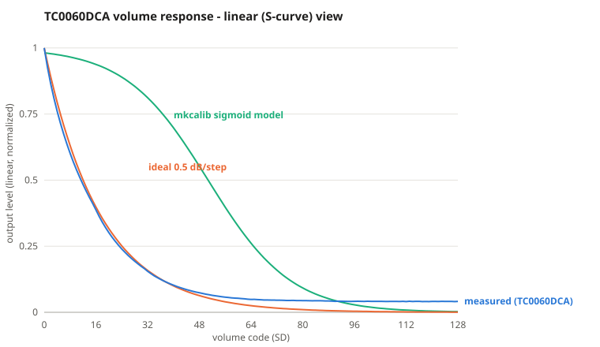
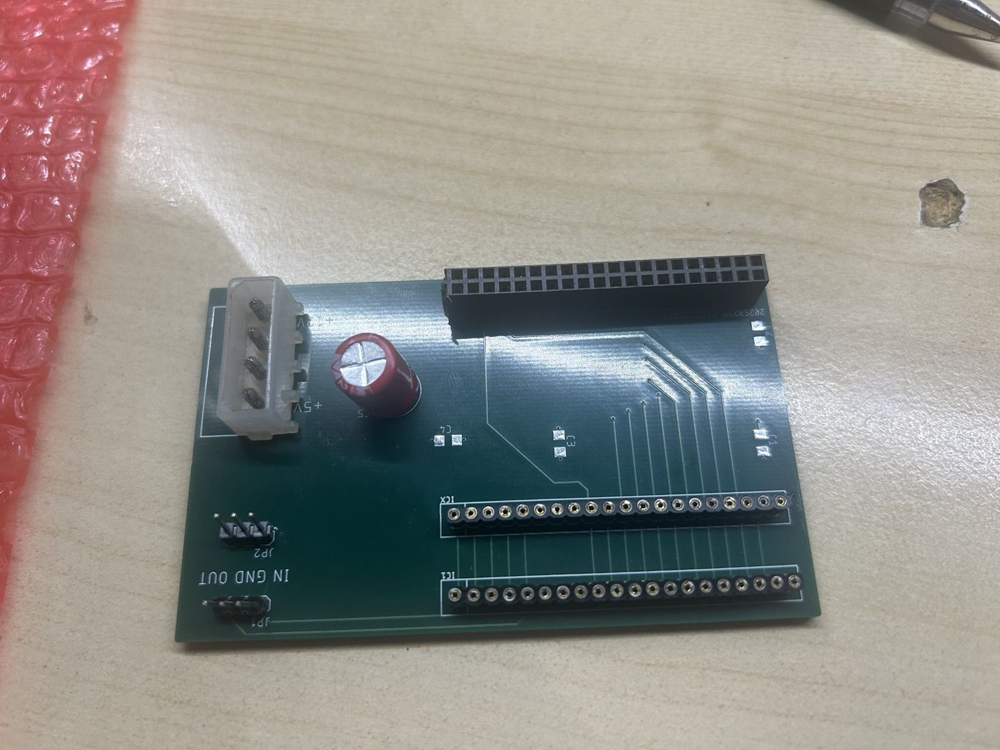
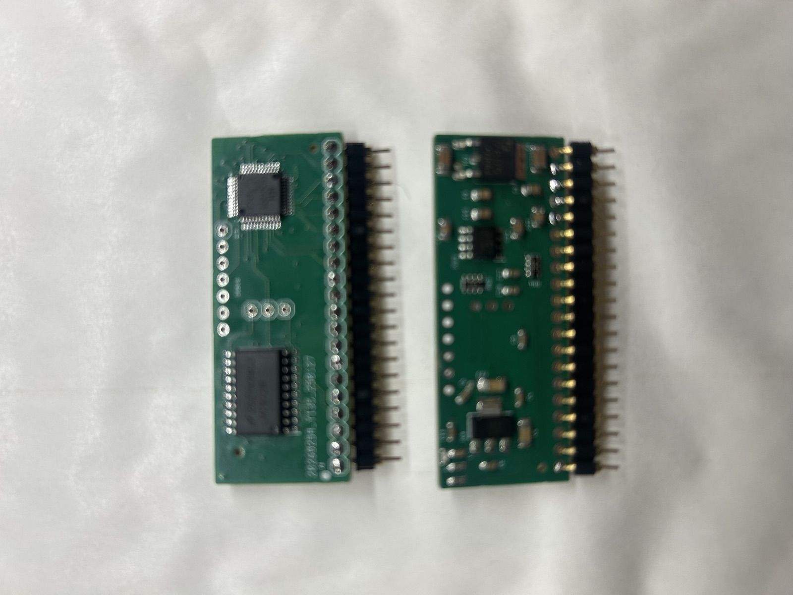
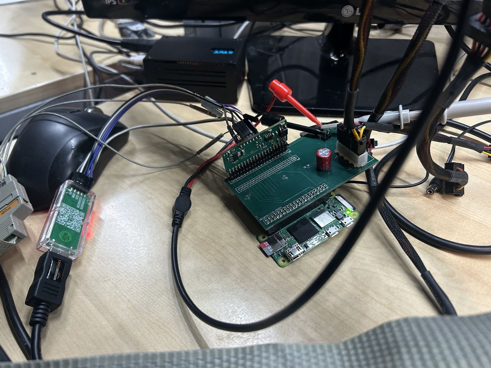
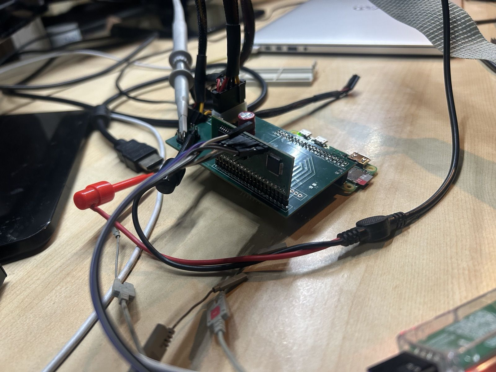
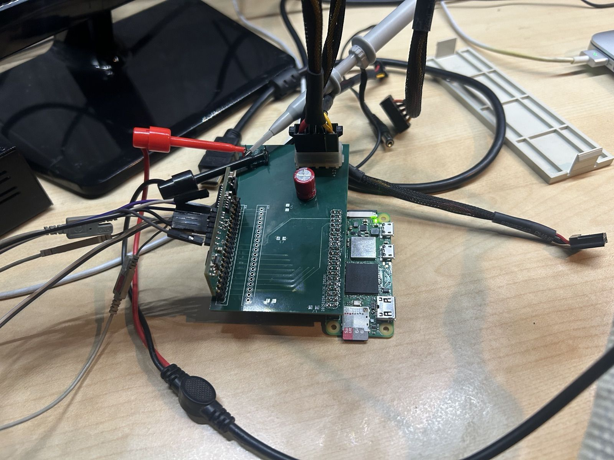
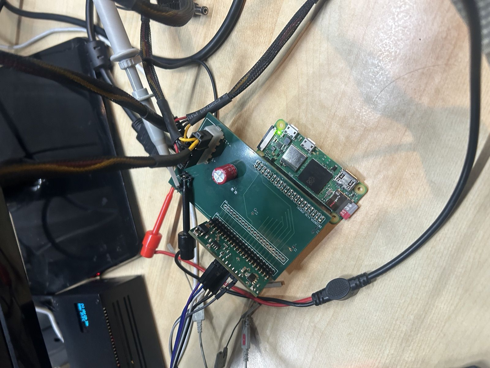

# TF0060DCA

Drop-in replacement for the Taito TC0060DCA custom dual digitally-controlled
attenuator (as used on the Operation Wolf sound board, Taito schematic
W5100215A). Two LM1972 digital attenuators driven from the original 8-bit
parallel volume bus by a CH32V203C8T6 RISC-V MCU, with a measured calibration
mapping.

The primary aim of this project was to give me repro modules for my Operation 
Wolf machine but I also passed the measured curves on to MAME where they have 
been integrated. 

## Community

Questions, build reports and general chat: [join the Discord](https://discord.gg/awMzHfB86T).

## Measured response

The original TC0060DCA's volume response was measured on the
[test fixture](testfixture/) by stepping the volume down from full scale and
recording the output level ([measured/measured.csv](measured/measured.csv)).
Note the x-axis counts *attenuation steps from full volume* (as in the
LM1972's register convention, where code 0 = 0 dB), not the machine's SD bus
value - on the SD bus the direction is inverted (SD 0 = silence, SD 255 =
full volume) and the firmware's mapping table performs that inversion. The device is a
linear-in-dB attenuator at almost exactly **0.5 dB per code step** (least-squares
fit over the first 45 codes: -0.49 dB/step, within +/-0.75 dB of a straight
line) until the measurement reaches the test rig's ~ -27 dB noise floor. This
is why the LM1972, a native 0.5 dB/step attenuator, is used as the replacement
part.

The same data in linear amplitude, alongside the sigmoid (S-curve) model from
[measured/mkcalib.py](measured/mkcalib.py): the measured response follows the
0.5 dB/step exponential closely, while the sigmoid model is a noticeably
different shape.

## Test fixture

The fixture that produced the measurements: a Raspberry Pi Zero drives the SD
volume bus and clocks while the DUT's audio output is measured. It carries two
20-pin SIP sockets so an original TC0060DCA and the TF0060DCA replacement can
be exercised side by side.

| | |
|---|---|
|  |  |
| *Bare fixture: Molex power in, Pi Zero header, two SIP-20 sockets* | *TF0060DCA replacement modules* |
|  |  |
| *On the bench, mounted on a Pi Zero* | *With a device under test fitted* |
|  |  |
| *Probing during a measurement run* | *Overhead: Pi Zero and fixture* |

## TC0060DCA pin 7 (V_B)

Pin 7 of the original TC0060DCA has been asked about; the evidence from the
original hardware and this project:

- **Original Taito schematic** (W5100215A, sheet 4-2, IC49): pin 7 is strapped
  directly to the same ground rail as pins 6, 10 and 20. There is no external
  bias network (no capacitor or divider). Pin 8 is drawn as an unconnected
  stub (N.C.).
- **Test fixture**: a real TC0060DCA runs correctly with pin 7 tied to GND —
  the measured response above was captured that way.
- **This replacement** leaves pin 7 unconnected (net `V_B`) and pin 8 N.C.,
  and functions in the host board.

So pin 7 is a ground-referenced bias/substrate connection ("V_B"), tied to 0 V
in the machine and carrying no signal; a replacement can safely leave it
unconnected. It is not a volume or audio pin.

## Design notes (FAQ)

**Are C8-C11, C14 and C15 polarized?** No. They are drawn with Eagle's `C-US`
device, whose American-style symbol has one straight and one curved plate for
*any* capacitor - a polarized cap in Eagle carries an explicit "+" mark, which
these don't have. Physically they are 0805 ceramic (MLCC) parts, inherently
non-polar, used as AC coupling in the audio path.

**Why does the response graph run loud-to-quiet?** The x-axis counts
attenuation steps from full volume, matching the LM1972 register convention
(datasheet SNAS094D Table 1: code 0x00 = 0.0 dB, 0.5 dB/step to 47.5 dB at
code 95, 1.0 dB/step to 78 dB at code 126, codes 0x7F-0xFF = 100 dB mute).
The machine's SD volume bus runs the other way (0 = silence, 255 = full
volume); the firmware's `lm1972_mapping` table inverts between the two
conventions.

**What value are the coupling caps?** These are AC couplers, so the exact
value is not critical - it only sets the high-pass corner, which sits far
below audio for anything in this region. The design value was a nominal 6 uF;
on the JLCPCB production run the part matcher resolved this to a 10 uF X5R
(Samsung CL21A106KOQNNNE, LCSC C1713), which is what is fitted on assembled
boards and what the schematic now records. If hand-building, 4.7 uF, 6.8 uF
or 10 uF are all fine.

- `eagle/` - EAGLE schematic/board plus CAM, BOM/CPL and check tooling
  (`make help` for targets; gerbers and PDF build via the terriblefire78
  Docker images)
- `firmware/` - CH32V203 firmware (builds in `terriblefire78/mrs:latest`,
  or `make firmware` from the repo root)
- `testfixture/` - EAGLE test fixture board
- `measured/` - measured attenuation data and calibration table generator
- `gerbers/` - manufactured revisions (JLCPCB)

## License

Copyright (c) 2026 Stephen Leary (TerribleFire).

This design and its firmware are licensed under
[Creative Commons Attribution 4.0 International](LICENSE) (CC BY 4.0): you may
use, modify, manufacture and sell derivatives for any purpose, provided you
credit the original design and work.

WCH vendor sources under `firmware/` (Nanjing Qinheng Microelectronics) retain
their own copyright notices.
